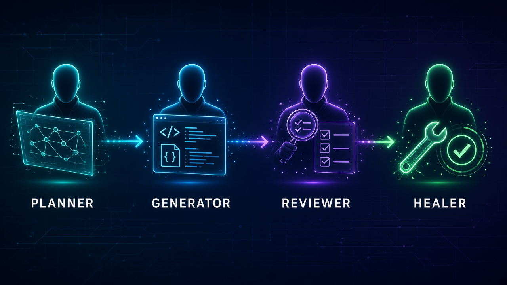

# testflow-ai

Agentic QA toolkit for the TestFlow ecosystem.



A business-rules document goes in; agents design a **QA system-design strategy per `SYS-*`**, then plan scenarios, generate cases + data + Playwright (UI-E2E only), review, and heal failing specs.

```text
docs/business-rules/
        │
        ▼
   ┌─────────┐    ┌───────────┐    ┌──────────┐    ┌────────┐
   │ Planner │ →  │ Generator │ →  │ Reviewer │ →  │ Healer │
   └─────────┘    └───────────┘    └──────────┘    └────────┘
        │               │                               │
        ▼               ▼                               ▼
  *.strategy.md    *.cases.md                     fix specs
  *.plan.md        specs/data/                    (no product-bug mask)
                   tests/**/*.spec.ts
```

Coverage loop (`/testflow-coverage`): **Planner → Generator (per UI-E2E case) → Healer**. Reviewer is on-demand.

## Layout

```text
.github/
  agents/      # Copilot custom agents (contracts)
  prompts/     # Copilot prompt files (*.prompt.md)
  skills/      # how-to playbooks
  workflows/   # coverage / CI / heal handoffs
.cursor/
  commands/    # Cursor slash commands (/testflow-*)
  skills/      # same playbooks (Cursor discovery)
docs/
  business-rules/   # input (source of truth)
specs/              # strategies, plans, cases, data
tests/              # Playwright specs
```

Skills are mirrored under `.github/skills/` and `.cursor/skills/` — keep them in sync.

## Agents

| Agent | File | Skills | Delivers |
|---|---|---|---|
| **Planner** | `testflow-planner.agent.md` | `testflow-strategy`, `testflow-traceability` | Per-system `specs/*.strategy.md` + scenario `*.plan.md` |
| **Generator** | `testflow-generator.agent.md` | `testflow-traceability`, `testflow-playwright` | Cases (`TC-*`), `specs/data/`, Playwright for UI-E2E only |
| **Reviewer** | `testflow-reviewer.agent.md` | strategy + traceability + playwright | Findings only (no edits unless asked to fix) |
| **Healer** | `testflow-healer.agent.md` | `testflow-heal`, `testflow-playwright` | Minimal spec/fixture fixes; does not mask product bugs |

There is no orchestrator agent. The **coverage** command/prompt sequences Planner → Generator → Healer.

### Planner (two phases)

1. **Strategy** — for each `SYS-*`, write `specs/<slug>.strategy.md` (8 QA system-design sections + MVP vs mature).
2. **Plan** — numbered scenarios (`1.`, `1.1`, …) citing `SYS-*` + `BR-*` + strategy path; non-UI work deferred by strategy.

### Generator (two modes)

- **Batch** — whole plan → cases + data + specs.
- **Per-case** — one plan item (coverage loop); one focused `*.spec.ts` when UI-E2E.

### Healer

Classifies failures (flake / selector / assertion / fixture / env / **product bug**). Product bugs stay failing unless you ask to quarantine.

## Skills

| Skill | Use for |
|---|---|
| [`testflow-strategy`](.github/skills/testflow-strategy/SKILL.md) | QA system design: risks, layers, data/env, ownership, CI/CD, observability, release, metrics |
| [`testflow-traceability`](.github/skills/testflow-traceability/SKILL.md) | `SYS-*` / `BR-*` / `TC-*`, plan/case/data templates, gap rules (+ [`templates.md`](.github/skills/testflow-traceability/templates.md)) |
| [`testflow-playwright`](.github/skills/testflow-playwright/SKILL.md) | seed, selectors, one-spec-per-case, fixtures, config (+ [`conventions.md`](.github/skills/testflow-playwright/conventions.md)) |
| [`testflow-heal`](.github/skills/testflow-heal/SKILL.md) | failure classification and heal guardrails |

### Traceability chain

```text
docs/business-rules/
  → SYS-* → *.strategy.md
  → BR-*  → plan scenario (1.1)
  → TC-*  → specs/data/ → Playwright (UI-E2E only, titled with TC-*)
```

## Commands & prompts

| Cursor (`/` in Agent chat) | Copilot prompt | Runs as |
|---|---|---|
| `/testflow-coverage` | `testflow-coverage.prompt.md` | Planner → Generator (per UI-E2E) → Healer |
| `/testflow-plan` | `testflow-plan.prompt.md` | Planner |
| `/testflow-generate` | `testflow-generate.prompt.md` | Generator |
| `/testflow-review` | `testflow-review.prompt.md` | Reviewer |
| `/testflow-heal` | `testflow-heal.prompt.md` | Healer |

## Workflows

| Workflow | Role |
|---|---|
| `testflow-coverage` | Issue handoff when `docs/business-rules/**` changes (or manual) |
| `testflow-ci` | Playwright gate (`npm test` on chromium) |
| `testflow-heal` | Issue handoff on CI failure or manual log |

## How to use

### Cursor

1. Put a document under `docs/business-rules/` (see [`example-checkout.md`](docs/business-rules/example-checkout.md)).
2. In **Agent** chat, type `/` and pick a command (files in `.cursor/commands/`).
3. Prefer `/testflow-coverage` for the full loop, or a single-step command.
4. Review `specs/` and `tests/` before merge.
5. On a failed run outside coverage: `/testflow-heal`.

### Copilot (VS Code)

Use the matching prompts under `.github/prompts/`, or the custom agents under `.github/agents/`.

### Local suite

```bash
npm install
npx playwright install chromium
npm test
```

Set `BASE_URL` when covering a real app. Seed/style anchor: `tests/seed.spec.ts`.

## Example artifacts (checkout)

| Artifact | Path |
|---|---|
| Business rules | `docs/business-rules/example-checkout.md` |
| Plan / cases | `specs/checkout.plan.md`, `specs/checkout.cases.md` |
| Strategies | `specs/*.strategy.md` (produced by planner) |
| Fixtures | `specs/data/` |
| Specs | `tests/**/*.spec.ts` |
